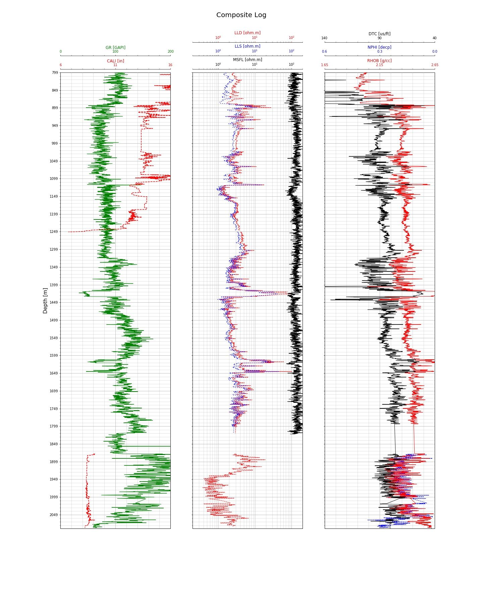

# log-analysis

Wireline Log Analysis

Requirements: <br>
```pip install -r requirements.txt```

<b> Part 1: </b> Clustering well log data <br>
<b> Part 2: </b> Predict Porosity and Permeability with Neural Networks

<b> Plotting the log data: </b> <br>

